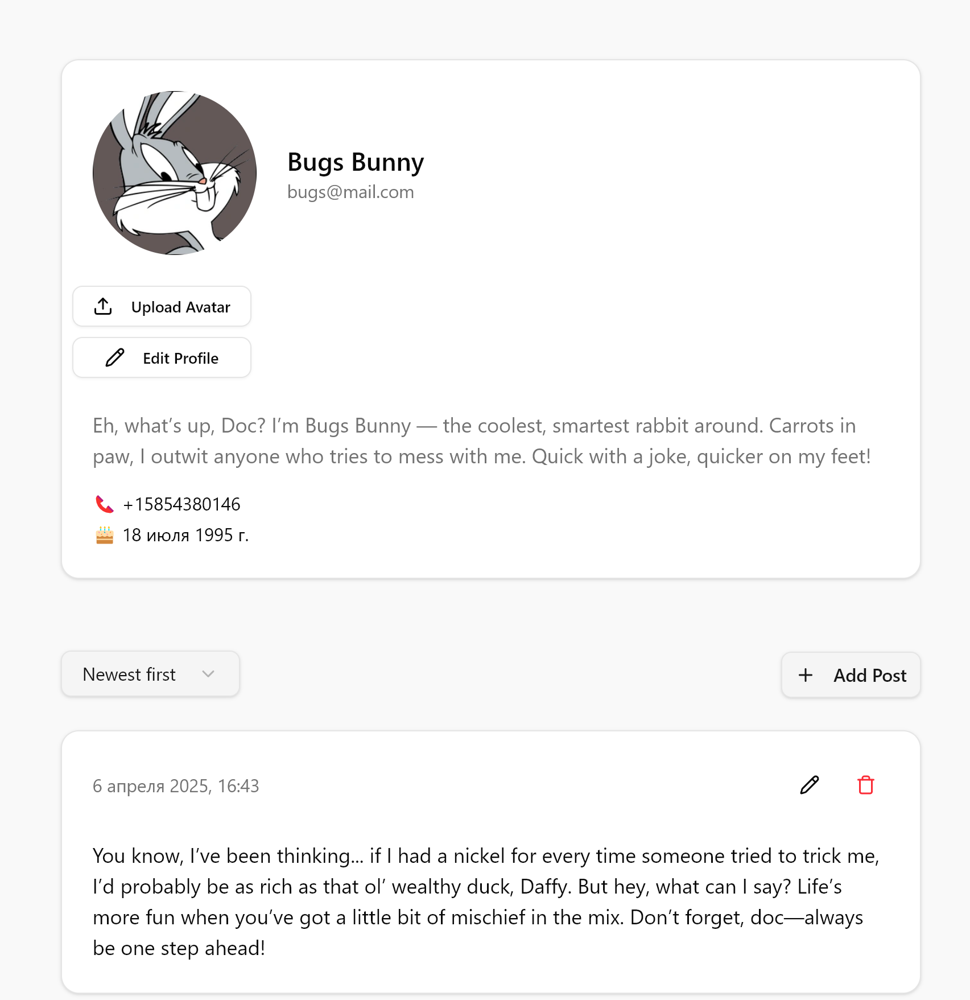
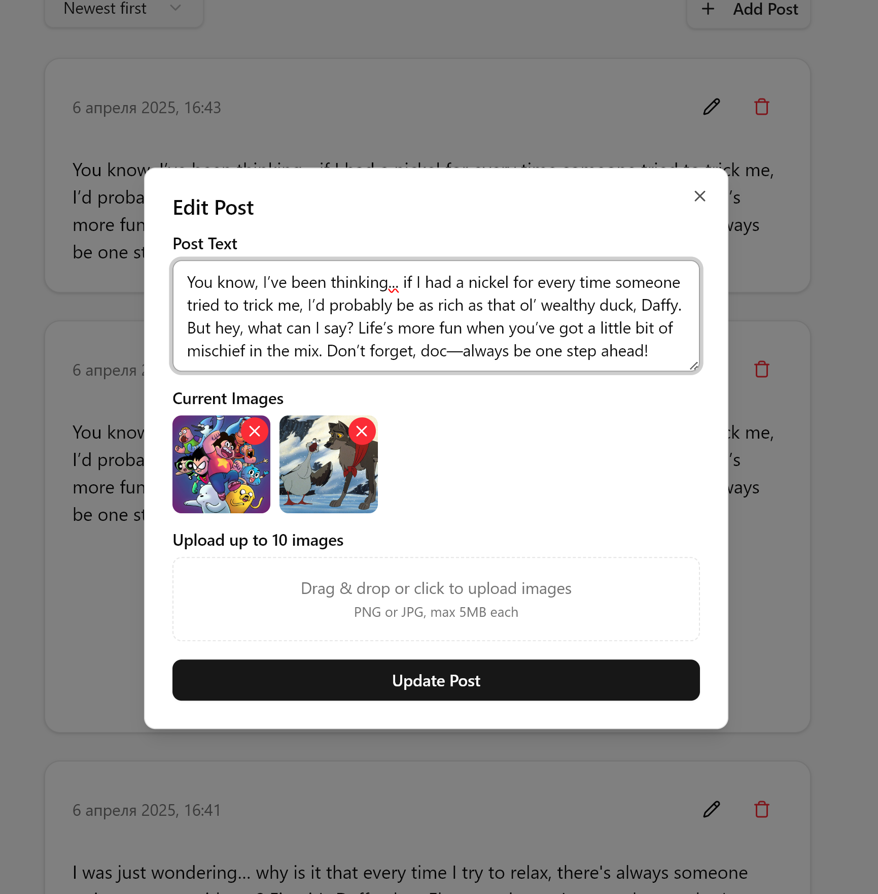

## Тестовое задание🛡️ Frontend — React + Tanstack Query + Zustand + JWT
<p align="center">
  
  
</p>

> ℹ️ Полное техническое задание доступно в корне проекта в файле  
> **Техническое задание.pdf**

**Тестовое задание** "Frontend для блога" — приложение с архитектурой Feature/domain-first, написанное с использованием Vite на  React + Tanstack Query + Zustand + Shadcn U.  
Проект реализует:

- Аутентификацию по JWT (access + refresh)
- Fingerprint-защиту refresh-токенов
- Управление профилем пользователя
- CRUD-функциональность постов
- Загрузку изображений (drag and drop)
- Валидацию данных через Zod
- Адаптивную верстку с использованием Tailwind CSS

### 🌐 Связанный backend
Backend для этого проекта доступен по ссылке:  
👉 [https://github.com/ziaq/test-task-blog-nestjs-postgres-jwt](https://github.com/ziaq/test-task-blog-nestjs-postgres-jwt)

---

### 🛠️ Технологии

- **React 19 + Vite** — SPA-фреймворк и инструмент сборки
- **TypeScript** — строгая типизация
- **Tailwind CSS** — утилитарная CSS-библиотека
- **Shadcn UI** — UI-компоненты
- **Zod** — валидация данных
- **React Hook Form** — формы
- **Tanstack Query** — работа с API и кэширование
- **Zustand** — глобальное хранилище
- **fingerprintjs** — защита refresh-токенов

---

## 🧠 Основной функционал

- 🔒 Аутентификация (JWT: access + refresh токены, fingerprint защита)
- 👤 Профиль пользователя (редактирование, аватар, контакты)
- 📝 Посты (создание, удаление, редактирование, добавление изображений)
- ⏳ Пагинация, сортировка постов
- 📦 Поддержка `multipart/form-data` через Dropzone
- 📷 Отображение изображений из файловой системы (`/uploads`)
- 💬 Полностью типизирован с `zod`
- 🌈 Стилизован с помощью `shadcn/ui`
-  🗄 Кэширование запросов
---

## 🚀 Запуск проекта

### 1. Клонировать репозиторий

```
git clone https://github.com/ziaq/test-task-blog-react-shadcn.git
cd test-task-blog-react-shadcn
```

### 2. Установить зависимости

```
npm install
```

### 3. Создать `.env` файл

Создай `.env` в корне проекта со следующим содержимым:

```
VITE_API_URL=http://localhost:3001
```

### 4. Запустить проект

```
npm run dev
```

**После запуска проект будет доступен по адресу:**

```
http://localhost:5171
```